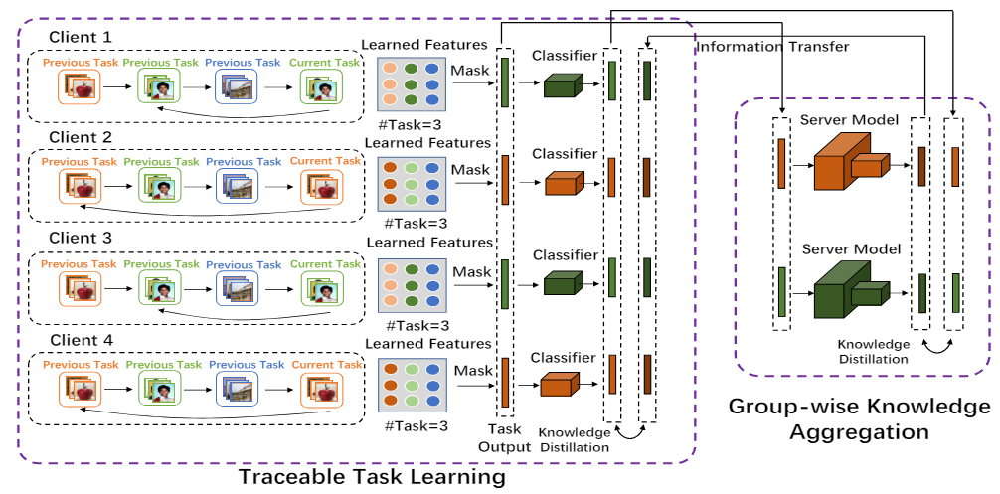
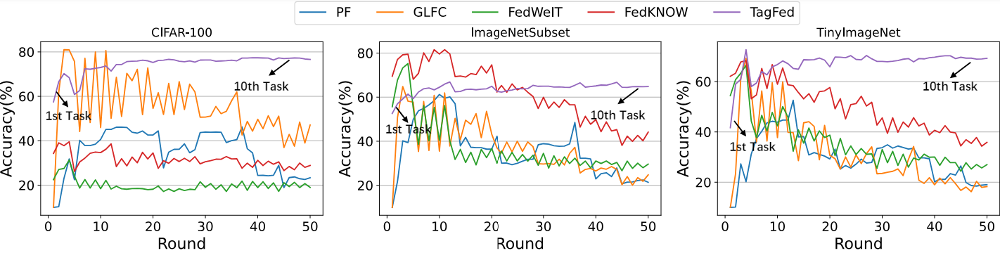

# Official Pytorch Implementation for TagFed

This is the implementation code of the CVPR 2024 paper "**Traceable Federated Continual Learning**"


## Framework:




## Prerequisites:

    * python == 3.6
    * torch == 1.2.0
    * numpy
    * PIL
    * torchvision == 0.4.0
    * cv2
    * scipy == 1.5.2
    * sklearn == 0.24.1

## Datasets:

* **CIFAR100:** You don't need to do anything before running the experiments on [CIFAR100](https://www.cs.toronto.edu/~kriz/cifar.html) dataset.

* **Imagenet-Subset (Mini-Imagenet):** Please manually download the on [Imagenet-Subset (Mini-Imagenet)](https://github.com/yaoyao-liu/mini-imagenet-tools) dataset from the official websites, and place it in './train'.

* **Tiny-Imagenet:** Please manually download the on [Tiny-Imagenet](https://github.com/seshuad/IMagenet) dataset from the official websites, and place it in './tiny-imagenet-200'.

## Training:

* Please check the detailed arguments in './src/option.py'.

```shell
python main.py
```

## Performance:



## Acknowledge:

We would like to thank the following related open source works:

1. [[CVPR-2022] Federated Class-Incremental Learning](https://openaccess.thecvf.com/content/CVPR2022/html/Dong_Federated_Class-Incremental_Learning_CVPR_2022_paper.html) [[Code]](https://github.com/conditionWang/FCIL?tab=readme-ov-file)
2. [[NeurIPS-2019] Compacting, Picking and Growing for Unforgetting Continual Learning](https://arxiv.org/pdf/1910.06562) [Code](https://github.com/ivclab/CPG)

